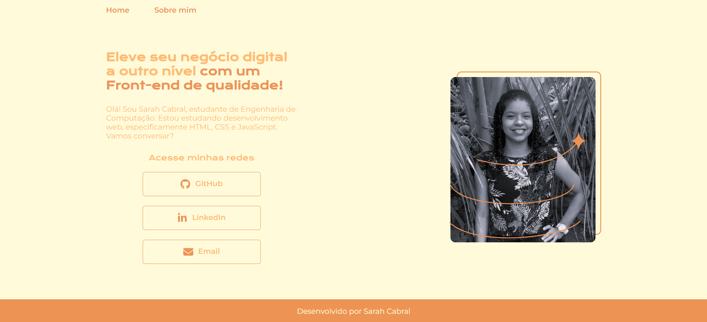

<h1 align="center">Portifólio</h1>

  <strong>🚀 Veja um pouco sobre mim e minha jornada da aprendizagem 📚</strong>

    <a href="#-visão-do-projeto">Visão do projeto</a> •
    <a href="#-layout">Layout</a> • 
    <a href="#-tecnologias">Tecnologias</a> •
    <a href="#-instruções">Instruções</a> •
    <a href="#-autora">Autora</a>
 

## 🔭 Visão do projeto

O projeto foi desenvolvido com base nos cursos de HTML e CSS da Alura como prática mediante os assuntos trabalhados durante a formação Iniciante em Programação da Oracle Next Education. Confira e veja um pouco mais sobre a autora e sobre suas habilidades, confira também as redes logo abaixo.

## 🎨 Layout
- O design está disponível no [Figma](https://www.figma.com/proto/3N50NADAVNzaz8WvgK8Ao5/Portfolio---Curso-HTML-e-CSS-Alura?t=gD4UsMCadlXxOLXX-1) para visualização. Fique a vontade para conferir!
- Clique na imagem abaixo e seja direcionado para o link da página.

## 💻 Tecnologias

## ⚙️ Instruções

- Ao clicar nos ícones das redes, você será direcionado automaticamente em uma nova aba para os perfis da autora.

## 🧙‍♂️ Autora

