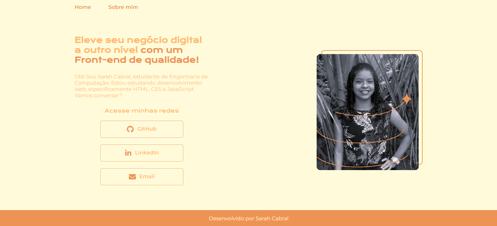
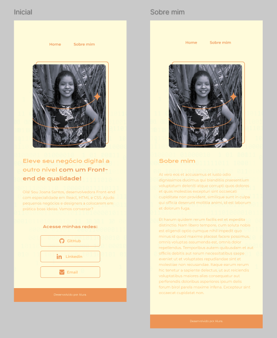

<h1 align= "center">Portifólio - Alura HTML e CSS</h1>

<a href="#-sobre-o-projeto">Sobre o projeto</a> •
 <a href="#-layout">Layout</a> • 
 <a href="#-tecnologias-e-habilidades">Tecnologias e Habilidades</a> • 
 <a href="#-autora">Autora</a>
 

 ## 💻 Sobre o projeto
 Um projeto desenvolvido durante a ministração dos cursos de HTML e CSS da plataforma de ensino Alura. A página mostra um pouco sobre a autora e suas habilidades.

 ## 🎨 Layout
 O design está disponível no [Figma](https://www.figma.com/proto/3N50NADAVNzaz8WvgK8Ao5/Portfolio---Curso-HTML-e-CSS-Alura?t=gD4UsMCadlXxOLXX-1) para visualização. 
 Clique nas imagens e seja direcionado para a página. Fique a vontade para conferir!

<h3>Desktop</h3>
    

        
    

<h3>Mobile</h3>
    

## 🛠 Tecnologias e Habilidades

* HTML
* CSS
* Flexbox
* Responsividade
* GitHub
* Vercel

## 🧙‍♂️ Autora

    
    @sarcabral
    

